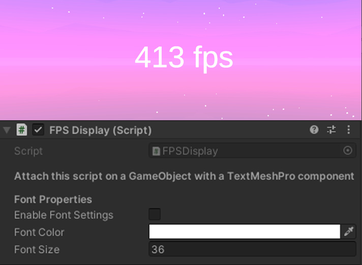

<h3 align="center">FPS Display For Unity</h3>

<!-- PROJECT LOGO -->

A simple code to display the FPS in your game.

<!-- TABLE OF CONTENTS -->

  
Table of Contents

  <ol>
    <li><a href="#about">About</a></li>
    <li><a href="#functions">Functions</a></li>
    <li><a href="#getting-started">Getting Started</a></li>
    <li><a href="#example">Example</a></li>
    <li><a href="#contact">Contact</a></li>
  </ol>

<!-- ABOUT THE PROJECT -->
## About

 
Ever wondered how you could display the FPS counter on your screen?
 
This [code](https://github.com/hamdanbasri/FPSDisplayForUnity) is here just to do that.

<!-- FUNCTIONS -->
## Functions

* Display your game fps on a text.
* Overwrite font color and font size.    

<!-- GETTING STARTED -->
## Getting Started

* Open Unity and add a <strong>Canvas</strong> to the scene.
* Create a <strong>Text - TextMeshPro</strong> as a child of the Canvas and rename it to <strong>FPSDisplayText</strong>.
* Attach the [FPSDisplay.cs](https://github.com/hamdanbasri/FPSDisplayForUnity) script to the <strong>FPSDisplayText</strong>.
* Press <strong>Play</strong> in your editor and all the <strong>FPSDisplayText</strong> will now display your in game fps.

<!-- USAGE EXAMPLES -->
## Example

As simple as attaching the script on a GameObject with a TextMeshPro component.

 
        <table>
        <tr>
            <td>Variable</td>
            <td>Annotation</td>
            </td>
        <tr>
            <td>Enable Font Settings</td>
            <td>If enable, the default font settings will be overwritten with the preset Font Properties</td>
        </tr>
        <tr>
            <td>Font Color</td>
            <td>Set the font color</td>
        </tr>
        <tr>
            <td>Font Size</td>
            <td>Set the font size</td>
        </tr>
        </table>

<!-- CONTACT -->
## Contact

[![LinkedIn][linkedin-shield]][linkedin-url]

(<a href="#readme-top">back to top</a>)

<!-- MARKDOWN LINKS & IMAGES -->
<!-- https://www.markdownguide.org/basic-syntax/#reference-style-links -->
[linkedin-shield]: https://img.shields.io/badge/-LinkedIn-black.svg?style=for-the-badge&logo=linkedin&colorB=555
[linkedin-url]: https://linkedin.com/in/hamdanbasri

